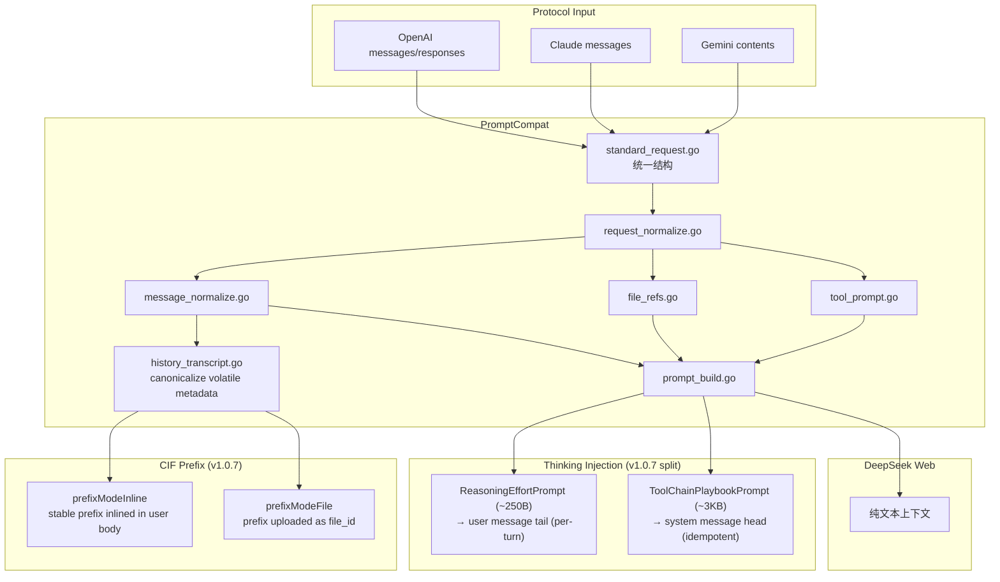
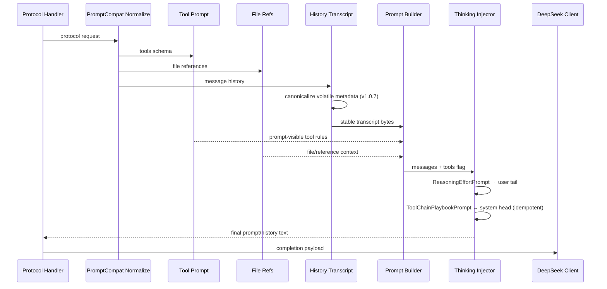

# Prompt 兼容流程

<cite>
**本文档引用的文件**
- [internal/promptcompat/standard_request.go](file://internal/promptcompat/standard_request.go)
- [internal/promptcompat/request_normalize.go](file://internal/promptcompat/request_normalize.go)
- [internal/promptcompat/message_normalize.go](file://internal/promptcompat/message_normalize.go)
- [internal/promptcompat/prompt_build.go](file://internal/promptcompat/prompt_build.go)
- [internal/promptcompat/tool_prompt.go](file://internal/promptcompat/tool_prompt.go)
- [internal/promptcompat/file_refs.go](file://internal/promptcompat/file_refs.go)
- [internal/promptcompat/thinking_injection.go](file://internal/promptcompat/thinking_injection.go)
- [internal/promptcompat/history_transcript.go](file://internal/promptcompat/history_transcript.go)
- [internal/httpapi/openai/history/current_input_prefix.go](file://internal/httpapi/openai/history/current_input_prefix.go)
- [internal/httpapi/openai/shared/thinking_injection.go](file://internal/httpapi/openai/shared/thinking_injection.go)
</cite>

## 目录

1. [简介](#简介)
2. [项目结构](#项目结构)
3. [核心组件](#核心组件)
4. [架构总览](#架构总览)
5. [详细组件分析](#详细组件分析)
6. [故障排查指南](#故障排查指南)
7. [结论](#结论)

## 简介

本文是仓库内 "API 请求 → DeepSeek Web 纯文本上下文" 的权威文档。OpenAI、Claude、Gemini 的请求形态不同，但进入 DeepSeek Web 前都需要归一化为统一的标准请求，再构造出系统指令、历史消息、工具说明、文件引用和当前用户输入。

> **v1.0.5 ~ v1.0.7 关键变更（按版本顺序）**
>
> - **v1.0.5**：Anthropic `mcp_servers` 字段不再被静默丢弃。`expandMCPServersAsTools` 把 `tool_configuration.allowed_tools` 与 `mcp_servers[].tools[]` 展开为 `<server>.<tool>` 命名的虚拟工具描述，注入到 `tools[]`。
> - **v1.0.5**：违禁屏蔽 `collectText` 取消顶层白名单限制，递归扫描所有 map 字段；`/admin /webui /healthz /readyz /static/ /assets/` 路径豁免内容扫描。
> - **v1.0.7 Thinking-Injection 拆分**：`DefaultThinkingInjectionPrompt` 按注入位置一分为二：`ReasoningEffortPrompt`（约 250 字节，per-turn，追加到最新 user message 尾部）和 `ToolChainPlaybookPrompt`（约 3 KB，稳定 playbook，幂等前置到 system message 头部）。详见下方"v1.0.7 Thinking-Injection 拆分"节。
> - **v1.0.7 CIF 内联前缀模式**：新增 `prefixModeInline`，无需上传文件，无 file_id，前缀字节直接内联到 user message 正文。详见下方"v1.0.7 CIF 内联前缀"节。
> - **v1.0.7 规范历史转写**：`BuildOpenAICurrentInputContextTranscript` 剥离 OpenClaw 的"untrusted metadata" JSON fences（message_id / timestamp / timestamp_ms），使前缀字节在各轮次间保持字节稳定。详见下方"v1.0.7 规范历史转写"节。
> - **v1.0.9**：附件改内联模式——`current_input_file.go` 的 `ApplyCurrentInputFile` 不再调上游 `upload_file`（避免账号速率限制），把 transcript 直接拼到 user 消息内容里；开关由 `server.remote_file_upload_enabled` / env `DEEPSEEK_WEB_TO_API_REMOTE_FILE_UPLOAD_ENABLED` 控制（默认 `false`）。
> - **v1.0.12**：Codex Responses API 的 `compaction` / `reasoning` input item 在 `responses_input_items.go` 静默跳过（返回 `nil`，不会被误当作 user content 进入 prompt）。
> - **v1.0.3**：`DefaultThinkingInjectionPrompt` 显著扩写，新增工具链纪律、工具链模式和 MCP 调用规范（详见 v1.0.3 增量节）。

**章节来源**
- [AGENTS.md](file://AGENTS.md)

### Codex / Responses compact recovery

- `compress_keep_recent` is counted by user-message boundaries. Each retained user instruction keeps its complete following assistant/tool chain, and all leading system messages are preserved.
- Incremental upstream-session rollover remains a separate transport rule: it keeps the immediately preceding assistant result plus the current input and always resends the forced response-format prompt.
- When a process-local Responses compaction handle has expired but the client supplies a fresh tail after that handle, the tail is treated as an explicit compact recovery request. It may be compacted even while ordinary `prompt_limit.auto_compress_enabled` remains disabled. Every recovered request rebuilds and budgets the actual incremental payload, including the forced response-format prompt, before it is sent upstream.
- The pinned-session cache accepts a constrained sliding compact window only inside the exact caller/session/account/surface/variant scope. It must match the leading system prefix, at least one previous user message, and the complete latest assistant response. Rotation counts actual upstream calls rather than the number of replayed user messages in a recovered window.
- Responses empty-output retries propagate the final switched account's replacement upstream session into the incremental branch. Subsequent turns therefore never combine one account with another account's `chat_session_id`; logs expose only fingerprints for this state.

## Live boundary and protocol notes

The live DeepSeek Web frontend was tested through the normal browser login
flow. Its model settings reported `input_character_limit=163840` for the Pro
(`expert`) tier and `input_character_limit=2621440` for Flash (`default`). The
frontend gate is strict: 163840 ASCII units completed successfully, while
163841 units were rejected locally and no completion request was sent. The
counter is JavaScript `String.length`, therefore it is UTF-16 code units. For
example, 81920 emoji characters occupy exactly 163840 units but 327680 UTF-8
bytes. The Flash value was observed in live configuration; its exact server
hard boundary was not probed, so the lower operational default remains
380000 units.

`prompt_limit` now reports the exact measured size and overflow amount in 413
responses. The optional `pro_flash_compression_enabled` switch is off by
default. When enabled for an oversized Pro request, the service makes one real
Flash completion to summarize older turns, rebuilds the Pro prompt, and only
retries Pro if the result is within the configured target. A failed or still
oversized summary returns the original 413; no local fake completion is
created.

`session_chunking_enabled` is a second, independent overflow strategy and is
also disabled by default. It does not summarize or rewrite the original
prompt. A Flash no-thinking planner selects a semantically safe UTF-16 split
boundary, and the gateway validates that boundary before use. Each non-final
fragment is sent on one fixed upstream session and branch. The gateway waits
until both a `response_message_id` and the first reasoning/content fragment
arrive, closes that response stream, sends a random probe, sends an explicit
cancel/retain-context control turn, and then advances to the next fragment.
Probe and cancellation turns are committed only when their response message ID
actually advances beyond the current parent. Empty or prematurely closed
control streams are retried up to four times with incremental backoff, so the
final fragment is never attached to an unfinished parent response.
The final fragment is sent to the originally requested model as a pinned child
turn. Every fragment, probe, cancellation turn, and final turn repeats the
request's forced response-format prompt. The original `StandardRequest`, usage
text, and history snapshot remain unchanged. If both overflow switches are
enabled, same-session chunking takes precedence and Flash summarization is not
run.

OpenAI Responses compaction is handled locally and conservatively.
`previous_response_id` is reconstructed from a per-caller in-process input
snapshot with the stored visible output appended. `POST /v1/responses/compact`
returns a canonical next context window containing retained recent items and a
`type: "compaction"` item whose `encrypted_content` is a random, opaque local
handle. The current Responses `compaction_trigger` compatibility path returns
the same window through normal Responses output events. Explicit compact uses
a real Flash completion to merge older turns into one rolling summary even
when the request is below the model hard limit; a result is stored only when
both its serialized state and rebuilt UTF-16 prompt are strictly smaller. A single
indivisible user/tool turn returns HTTP 422 instead of a misleading no-op
handle. Logs report wire bytes, before/after message counts, state bytes,
prompt units, summary source/output units, duration, attempts, and reduction
percentages. The handle resolves only for the same
caller, uses a sliding process-local idle TTL of at least 24 hours, and becomes
unavailable after expiry or a process restart; it is not OpenAI/provider-owned
ciphertext and cannot be transferred to another proxy. Standalone compact
output must be passed to the next request as-is.

On a later request, a recognized local handle expands back to its canonical
locally compacted message window before prompt normalization. Unknown provider
state, `context_compaction`, `compaction_trigger`, and reasoning state are
never stringified into the DeepSeek prompt. Visible client-provided
`compaction` summaries remain prompt text. Anthropic `context_management.edits`
supports the real `clear_thinking*` operation and its `keep` policy (`all`,
`none`, or a numeric count); unknown edits are ignored without inventing state.
Thinking and non-thinking requests continue to use separate upstream flags
throughout these paths.

For ordinary Responses requests, the official shape is
`context_management: [{"type":"compaction","compact_threshold":200000}]`.
The threshold is a positive rendered-token count, measured with the service's
tokenizer; it never changes the model's UTF-16 hard input limit. Once crossed,
the service runs the Flash summary before the main completion and prepends the
opaque compaction item to the same non-stream response or SSE stream. The item
is stored in `previous_response_id` snapshots and can also be used for
stateless array chaining. The independent operator setting
`prompt_limit.summary_compaction_threshold` remains a model-window ratio for
background automatic summaries and is disabled by default.

The summary request always places `--- COMPACTION OUTPUT REQUIREMENTS ---`
after the source transcript, so the required output contract is the final
instruction seen by the upstream model. DeepSeek completion failures are also
checked before normal SSE parsing: the Web API can return HTTP 200 with a bare
JSON business error such as `data.biz_code=5` and `data.biz_msg="user is
muted"`. Such responses are not treated as empty model output. Managed
accounts are marked `temporarily_muted` and skipped immediately; explicit ban
messages are persisted as `upstream_banned`. Each retry capture records the
actual routed account. Active mute/rate-limit cooldowns are retained until
their expiry and are not cleared early by a weaker periodic health-check
success.

## Incremental upstream session continuation

The gateway also has a separate process-local incremental lane for Chat
Completions, Responses, Claude Messages, and Gemini (Gemini is translated into
the Chat handler). It is enabled only when `auto_delete.mode` is `none`, since
the retained DeepSeek session is the state being reused. A successful full
turn records the canonical request messages, the exact visible assistant/tool
response messages, the DeepSeek `chat_session_id`, and the response message ID.

For Responses `previous_response_id` chains, that request snapshot is always
the canonical pre-CIF message list. CIF may rewrite the transport payload into
a single file/transcript envelope for the upstream call, but that envelope is
never persisted as client conversation state; restoring it on the next turn
would make strict incremental matching fail and repeatedly nest transcript text.

On a later request, the cache accepts only an exact extension of that recorded
prefix. The request must contain the same prior user/assistant/tool messages in
the same order and then at least one new message. Edited history, a changed
model/thinking/search/tool contract, a different caller/account/session key,
or a concurrent use of the same branch is a cache miss. The cache keeps at
most eight branch lanes per scope and expires them after six hours of process
uptime; it is intentionally not persisted across restart.

Every incremental completion sends both parts, in this order:

1. A fresh forced-output-format system prompt. It requires the model to
   continue from the supplied parent, emit only the newest assistant response,
   and obey the current tool/output contract. Tool schemas and tool-call
   instructions are repeated on every incremental turn.
2. Only the new role blocks after the cached prefix. Prior transcript text is
   never copied into the incremental prompt.

The request uses the cached DeepSeek session and parent message ID through a
pinned completion call. Account failover and empty-output account switching
are disabled for that call, because changing account would invalidate the
parent. If the pinned call fails, the lease is discarded and the same request
falls back to the existing full-history path with a new session; the client
does not receive a partial or protocol-invalid response.

This is the practical 1M-context strategy: each new turn can be small while
DeepSeek retains the accumulated history in its own session. It does **not**
raise the upstream model's single-request input ceiling, survive process
restart, or make an edited/branched transcript reusable. Dynamic upstream
input limits and the existing compact/CIF compression gates still apply to a
full replay and to the incremental delta itself.

The operational `max_chars_*` names are retained for configuration
compatibility, but their values are UTF-16 code-unit budgets, matching the
live web client rather than UTF-8 byte counts.

At runtime the authenticated DeepSeek client now reads
`GET /api/v0/client/settings?scope=model` through the account's configured
proxy transport and caches the parsed default/expert limits per credential for
10 minutes. The effective request budget is always
`min(operator max_chars_*, upstream input_character_limit)`. A settings lookup
failure logs a warning and falls back to the atomic operator snapshot, so a
temporary settings outage does not block completions.
- [internal/promptcompat/standard_request.go](file://internal/promptcompat/standard_request.go)

## 项目结构



**图表来源**
- [internal/promptcompat/standard_request.go](file://internal/promptcompat/standard_request.go)
- [internal/promptcompat/request_normalize.go](file://internal/promptcompat/request_normalize.go)
- [internal/promptcompat/prompt_build.go](file://internal/promptcompat/prompt_build.go)
- [internal/promptcompat/thinking_injection.go](file://internal/promptcompat/thinking_injection.go)
- [internal/httpapi/openai/history/current_input_prefix.go](file://internal/httpapi/openai/history/current_input_prefix.go)

**章节来源**
- [internal/httpapi/openai/chat/handler_chat.go](file://internal/httpapi/openai/chat/handler_chat.go)
- [internal/httpapi/claude/convert.go](file://internal/httpapi/claude/convert.go)
- [internal/httpapi/gemini/convert_request.go](file://internal/httpapi/gemini/convert_request.go)

## 核心组件

- `StandardRequest`：协议无关的标准请求对象。
- 消息归一化：把 system、developer、user、assistant、tool 等角色转换为统一消息序列。
- 工具提示注入：把工具定义转换为模型可见的调用格式说明。
- 文件引用处理：把上传文件、当前输入文件和引用片段转成可见上下文。
- 历史转写（`BuildOpenAICurrentInputContextTranscript`）：把之前的对话和工具结果压成纯文本历史；**v1.0.7 起剥离 OpenClaw volatile metadata（message_id / timestamp / timestamp_ms），确保前缀字节在各轮次间字节稳定**。
- **Thinking 注入（v1.0.7 拆分）**：
  - `ReasoningEffortPrompt`（~250 字节）：per-turn，通过 `AppendThinkingInjectionPromptToLatestUser` 追加到最新 user message 尾部。功能：对抗上游 fast-path 跳过 thinking 的倾向，提醒模型不要跳过推理。
  - `ToolChainPlaybookPrompt`（~3 KB）：跨 turn 稳定，通过 `PrependPlaybookToSystem` 幂等前置到 system message 头部（与 DSML format RULES 并排）。功能：工具链纪律 + 5 种工作流模式 + MCP 调用规范 + 停止判据。
- CIF 前缀复用（`current_input_prefix.go`）：对长对话建立稳定前缀边界，减少每轮重复传输整个历史；分 inline 和 file 两种模式（见详细分析）。

**章节来源**
- [internal/promptcompat/standard_request.go](file://internal/promptcompat/standard_request.go)
- [internal/promptcompat/tool_prompt.go](file://internal/promptcompat/tool_prompt.go)
- [internal/promptcompat/thinking_injection.go](file://internal/promptcompat/thinking_injection.go)
- [internal/promptcompat/history_transcript.go](file://internal/promptcompat/history_transcript.go)

## 架构总览



**图表来源**
- [internal/promptcompat/prompt_build.go](file://internal/promptcompat/prompt_build.go)
- [internal/promptcompat/file_refs.go](file://internal/promptcompat/file_refs.go)
- [internal/promptcompat/tool_prompt.go](file://internal/promptcompat/tool_prompt.go)
- [internal/httpapi/openai/shared/thinking_injection.go](file://internal/httpapi/openai/shared/thinking_injection.go)

**章节来源**
- [internal/httpapi/openai/shared/thinking_injection.go](file://internal/httpapi/openai/shared/thinking_injection.go)

## 详细组件分析

### v1.0.7 Thinking-Injection 拆分

#### 拆分原因

旧版本（v1.0.6 及更早）将整个 ~3 KB 的 `DefaultThinkingInjectionPrompt` 写入**最新 user message 尾部**，导致两个问题：

1. **重复**：工具链 playbook 已经在 system message 中通过 `BuildToolCallInstructions` 注入了 DSML format 规则，每次请求会携带两份近似规则集，user prompt 被下推约 3 KB。
2. **Fast-path 丢失**：当上游 DeepSeek 走 no-thinking fast path（`thinking_enabled=true` 但返回空 `reasoning_content`）时，写入 user message 尾部的 playbook 被"读"但未"推理"，工作流模式（READ-BEFORE-EDIT 等）被静默跳过，模型直接输出 prose 而非 tool_use 块。

#### 拆分后结构

```
ReasoningEffortPrompt（~250 字节）
→ 追加到最新 user message 尾部（per-turn）
→ 目标：对抗 fast-path，提醒模型进行推理
→ 内容：Reasoning Effort: Absolute maximum + 一句行动指令

ToolChainPlaybookPrompt（~3 KB）
→ 幂等前置到 system message 头部
→ 目标：工具链规则在 fast-path 下仍然生效（system message 不受 reasoning bypass 影响）
→ 内容：工具链纪律 4 条 + 工作流模式 A-E + MCP 调用规范 + 停止判据
```

#### 实现接口

```go
// internal/promptcompat/thinking_injection.go

// ReasoningEffortPrompt 约 250 字节，per-turn
ReasoningEffortPrompt = ThinkingInjectionMarker + "\n" + ...

// ToolChainPlaybookPrompt 约 3 KB，稳定跨 turn
ToolChainPlaybookPrompt = "Tool-Chain Discipline ...\nTool-Chain Patterns ...\nMCP Tool Invocation ...\nStopping Criteria ..."

// internal/httpapi/openai/shared/thinking_injection.go 调用顺序：
next, sysChanged := promptcompat.PrependPlaybookToSystem(messages, promptcompat.ToolChainPlaybookPrompt)
next, userChanged := promptcompat.AppendThinkingInjectionPromptToLatestUser(messages, promptcompat.ReasoningEffortPrompt)
```

`PrependPlaybookToSystem` 幂等：检测 system message 中是否已含 playbook 字符串，若含则不插入，防止每请求重复追加。

### v1.0.7 规范历史转写（Canonical History）

#### 问题根因

OpenClaw（及部分 Claude Code 客户端）在 user message 正文中注入 "untrusted metadata" JSON fence，格式如：

```
Conversation info (untrusted metadata):
```json
{
  "message_id": "msg_abc123",
  "timestamp": "2025-05-07 22:48:01",
  "timestamp_ms": 1746624481000
}
```
```

`message_id`、`timestamp`、`timestamp_ms` 每轮不同，导致历史转写的字节在每次请求时都发生变化——任何以前缀字节为缓存键的机制（无论是 ds2api 的 CIF 前缀还是上游的 prompt-prefix KV Cache）都会在每轮看到不同的字节，永远无法命中。

#### 修复实现

`internal/promptcompat/history_transcript.go`：

- `BuildOpenAICurrentInputContextTranscript`：调用 `buildOpenAIHistoryTranscript(..., canonicalizeVolatileMetadata=true)`。
- `canonicalizeVolatileTranscriptText`：通过正则 `volatileMetadataBlockRE` 匹配 "untrusted metadata" JSON fences（含 `Conversation info` 和 `Sender` 两种变体）。
- `canonicalizeMetadataJSON`：从匹配的 JSON 对象中删除 `message_id`、`timestamp`、`timestamp_ms` 键，保留其余字段，然后以紧凑无空白格式重新序列化，确保每轮同一会话的相同消息内容输出字节完全一致。

效果：同一会话中第 N 轮和第 N+1 轮的历史 transcript（前 N-1 条消息部分）字节完全一致，前缀缓存得以命中。

### v1.0.7 CIF 内联前缀模式（prefixModeInline）

#### 两种模式对比

| 维度 | `prefixModeFile`（旧模式）| `prefixModeInline`（v1.0.7 新增）|
|---|---|---|
| 前缀传递方式 | 上传为文件，凭 file_id 引用 | 字节直接内联到 user message 正文 |
| 依赖 RemoteFileUpload | 是（需 enabled=true）| 否（默认 disabled 时也可用）|
| 账号绑定 | file_id 是 per-account，key 含 accountID | 前缀字节账号无关，key 不含 accountID |
| 规避的风险 | 无 | 跳过 `upload_file` 接口，规避上游账号级速率限制 |
| 默认状态 | 需 `remote_file_upload_enabled=true` 才生效 | v1.0.7 起默认路径 |

#### 内联前缀正文结构（verbatim）

```
[stable prefix bytes — verbatim BuildOpenAICurrentInputContextTranscript 输出，截至某条 transcript 边界]

--- RECENT CONVERSATION TURNS ---

[recent tail bytes — target 32 KB，max 128 KB]

--- INSTRUCTION ---
Everything above the "RECENT CONVERSATION TURNS" marker is stable prior context — treat it as background and do not re-deliberate it. The section below that marker contains the most recent turns including the latest user request. Respond to that latest user request directly.
```

**关键约束**：正文的**第一个字节**必须是稳定前缀的第一个字节，不能有任何前置文本头——否则上游 prompt-prefix KV Cache 的字节前缀匹配每轮都会失败（位置 0 的字节每轮不同）。结构分隔符（`--- RECENT CONVERSATION TURNS ---`）严格插在稳定前缀**之后**，保证前导字节的稳定性。

#### 多变体链（Variants）

每个 session 最多保留 **2 个前缀变体**（`currentInputPrefixMaxVariants = 2`），以 MRU（最近使用）顺序排列：

- 命中时：选择能覆盖当前 fullText 且 tail 不超过 128 KB 的**最长**匹配前缀（最大化被 KV Cache 复用的字节数）；命中的变体提升到队列头部（LRU promote）。
- 刷新时（前缀不再是 fullText 的前缀）：计算新的分割点，将新前缀 prepend 到变体列表，旧前缀降格到第二位（供 agent 对话 summarize+prune 场景回退复用）。

#### 分割点计算

`splitCurrentInputPrefixTail` 支持两种模式：

- **标准模式**（transcript ≥ 32 KB）：从末尾数 32 KB 处开始找最近的 `\n=== ` role block 边界，确保 tail 为约 32 KB 对齐的完整角色块序列。
- **软锚模式**（transcript < 32 KB）：切在最后一个 `\n=== ` 边界之前，prefix = 所有更早内容，tail = 最后一个角色块。短对话第一轮即建立可复用锚点，第二轮起命中前缀。

#### 缓存 key 模式差异

```go
// prefixModeFile: key 含 accountID（file_id per-account，跨 account 重用不安全）
// prefixModeInline: key 不含 accountID（prefix bytes account-agnostic，
//   避免 429 重试链强制换 account 导致每个 account 各自一份 prefix state）
func currentInputPrefixKeyForMode(a *auth.RequestAuth, stdReq, modelType, mode) string
```

### v1.0.3 增量：Thinking-Injection 扩写

`thinking_injection.go` 的 `DefaultThinkingInjectionPrompt`（第 7 行）在原有"最大化推理"基础上追加了三个完整模块：

**工具链纪律（4 条规则）**：① CALL（仅在需要未知信息或外部操作时调用）；② PARALLEL vs SEQUENTIAL（无依赖放同一 `<|DSML|tool_calls>` 块并发）；③ AFTER A RESULT（读结果后链式继续或给最终答案，同参数同工具失败两次后禁止第三次）；④ STOP（请求满足即停止）。

**工具链模式 A-E**：READ-BEFORE-EDIT、SEARCH→NARROW→INSPECT、BASH+DIAGNOSIS、PARALLEL RESEARCH、CONDITIONAL FOLLOW-UP，每种均附完整 DSML 示例。

**MCP 调用规范**：`<server>.<tool>` 点号命名空间调用；参数名来自 `input_schema`；不能臆造未声明 server 名；可与常规工具在同一块并行调用。

**章节来源**
- [internal/promptcompat/thinking_injection.go](file://internal/promptcompat/thinking_injection.go)
- [internal/httpapi/openai/shared/thinking_injection.go](file://internal/httpapi/openai/shared/thinking_injection.go)
- [internal/httpapi/openai/history/current_input_prefix.go](file://internal/httpapi/openai/history/current_input_prefix.go)
- [internal/promptcompat/history_transcript.go](file://internal/promptcompat/history_transcript.go)

### Prompt 体积上限与历史自压缩（prompt_limit）

拼接完成的 prompt（system + playbook + 历史 transcript + 工具 schema + 最新用户输入）在发往
`/api/v0/chat/completion` 之前会先过一道字符上限。默认值**来自生产 chat_history 数据校准**
（去重后的逻辑请求，非重试行）：expert 档（`model_type: "expert"`，即 `deepseek-v4-pro` /
`deepseek-v4-pro-search`）在 ~150k 字符处出现可靠性拐点——150k 以下 15/15 全通过，150k 以上
仅 3/8（~37%）成功；default 档（flash）在观测范围内（最大成功 380k）无退化。**注意失败机制
是 `upstream_empty_output`（上游重试耗尽的空输出），不是尺寸硬拒绝**——压缩把请求控制在拐点
以下可显著提升成功率，但不是唯一因素。上限按档位区分：

| 配置项 | 默认值 | 作用 |
|--------|--------|------|
| `prompt_limit.enabled` | `true` | 总开关；`false` 时完全不检查、不压缩 |
| `prompt_limit.max_chars_default` | `380000` | default 档（flash）上限，取观测最大成功值 |
| `prompt_limit.max_chars_expert` | `150000` | expert 档（pro）上限，取可靠性拐点 |
| `prompt_limit.auto_compress_enabled` | `false` | 是否允许超限时自动丢弃早期轮次；默认关闭，避免静默丢失上下文 |
| `prompt_limit.compress_keep_recent` | `6` | 保留的最近轮数（1 轮 ≈ user + assistant 两条） |
| `prompt_limit.compress_keep_system` | `true` | 始终保留首条 system message |
| `prompt_limit.pro_flash_compression_enabled` | `false` | Pro 超限时是否真实调用 Flash 总结早期历史 |
| `prompt_limit.pro_flash_compression_target_chars` | `150000` | Flash 总结后要求 Pro prompt 不超过的 UTF-16 单元数 |
| `prompt_limit.session_chunking_enabled` | `false` | 超限时是否保留原文并在同一固定上游会话中逐段提交；启用后优先于 Flash 摘要 |
| `prompt_limit.session_chunking_target_ratio` | `0.85` | 每个分段相对当前模型 UTF-16 上限的目标比例；为协议封装与格式提示词预留空间 |
| `prompt_limit.session_chunking_max_chunks` | `16` | 单个请求允许的最大分段数，超过时明确失败而不截断原文 |
| `prompt_limit.session_chunking_commit_timeout_seconds` | `30` | 每个中间轮等待 `response_message_id` 与首个思考/正文片段的超时 |

档位判定统一走 `config.GetModelType`，模型表是唯一事实来源；`prompt_limit` 可通过
`config.json` / `DEEPSEEK_WEB_TO_API_CONFIG_JSON` 或 WebUI 的 `PUT /admin/settings` 配置。
管理界面只写入明确列出的字段，未提交的字段保持原值。

#### 执行顺序：压缩必须早于 CIF

```
NormalizeOpenAIChatRequest → ApplyThinkingInjection
  → CompressPromptBeforeCIF   ← 仅开关开启或显式 compact 时丢弃早期轮次
  → applyCurrentInputFile     ← CIF 把整段 transcript 折叠成 1 条 user message
  → RunSafetyCheckAndBlock
  → TryPrepareSessionChunking ← 可选：同会话逐段提交原文，最后一段固定父消息继续
  → TryFlashCompressPrompt    ← 可选：仅在未使用同会话分段时总结较早历史
  → EnforcePromptLimit        ← 两种方案均未启用或未能缩减时返回 413
```

顺序不可交换。CIF 的两条路径（`applyCurrentInputStablePrefix` / `applyCurrentInputInlinePrefix`）
都会把 `stdReq.Messages` 重写为**单条**合成 user message：

```go
messages := []any{map[string]any{"role": "user", "content": body}}
stdReq.Messages = messages
```

一旦 CIF 执行完毕，`Messages` 只剩 1 个元素，按轮次裁剪的结构信息已经不存在，压缩器只能空转。
由于 `current_input_file.enabled` 默认为 `true`，压缩放在 CIF 之后等于在长上下文场景**完全失效**。
放在 CIF 之前，CIF 便基于已裁剪的历史重建 transcript，缩减量才真正到达上游。

`EnforcePromptLimit` 是 CIF 之后的独立兜底：CIF 会把完整 transcript 连同它自己的指令块内联进
prompt，最终字节数只有此刻才能确定，可能在压缩后仍然超限。此时已无可裁剪结构，直接返回
`413 prompt_too_large`，而不是把注定失败的请求送去上游。

#### 压缩策略

`CompressToFit` 从 `compress_keep_recent` 出发逐次折半（6 → 3 → 1），每轮用
`CompressMessages` 重建消息列表并重算 prompt，一旦落到上限内立即返回：

- 保留首条 system message（受 `compress_keep_system` 控制）；
- 保留最近 `keep * 2` 条非 system 消息；
- **丢弃窗口开头的孤儿 tool result**：在任意位置切断历史，可能留下一条 `tool` / `function`
  消息而产生它的 assistant `tool_calls` 已被丢弃。这种残缺配对属于非法交换序列，部分客户端与
  解析器会直接拒绝，因此 `dropLeadingOrphanToolResults` 会剥掉开头这一串；
- 兜底保证：若整个窗口都是孤儿 tool result，至少保留最后一条消息，绝不产出空对话。

**章节来源**
- [internal/promptcompat/prompt_compress.go](file://internal/promptcompat/prompt_compress.go)
- [internal/httpapi/openai/shared/prompt_compress.go](file://internal/httpapi/openai/shared/prompt_compress.go)
- [internal/config/models.go](file://internal/config/models.go)

## 故障排查指南

- 模型忘记工具调用结果：检查 tool/result 消息是否进入标准消息序列。
- Claude Code 会话中断：检查流式消息是否被过早 finalize，工具结果是否被识别为独立内容。
- 文件内容没有进入上下文：检查 `/v1/files` 上传结果和 `current_input_file` 配置。
- 输出出现引用噪声：检查 `compat.strip_reference_markers`。
- 模型不调用工具链 / 工具调用顺序混乱：确认 `thinking_injection.enabled=true`；v1.0.7 前的旧版本缺少 READ-BEFORE-EDIT 约束顺序明示，升级后会显著改善；v1.0.7 起 ToolChainPlaybookPrompt 在 system message 中，fast-path 场景也能生效。
- MCP 工具不路由到正确服务器：检查调用名是否带 `<server>.` 前缀；未带前缀的工具名不会被路由到 MCP。
- CIF 前缀每轮刷新而非复用：检查 `BuildOpenAICurrentInputContextTranscript` 是否覆盖了 OpenClaw volatile metadata 剥离；若客户端注入 `message_id` / `timestamp` 但使用的是旧版本 ds2api（v1.0.7 前），前缀字节每轮变化，升级后修复。
- `ReasoningEffortPrompt` 被重复注入多次：检查 `AppendThinkingInjectionPromptToLatestUser` 的幂等检测是否生效（依赖 `ThinkingInjectionMarker` 字符串检测）；若 user message 内容不是 string 类型而是 content block 数组，确认 `NormalizeOpenAIContentForPrompt` 能正确合并文本。
- `ToolChainPlaybookPrompt` 每请求都被插入：检查 `PrependPlaybookToSystem` 的幂等检测；函数通过 `strings.Contains(existing, playbook)` 检测已有 playbook，若 playbook 内容版本不一致（旧版 playbook 和新版 playbook 字符串不同）会造成重复插入，升级时需确认历史 system message 不含旧版 playbook 残留。
- 专家模式（`deepseek-v4-pro*`）长文本报错而 flash 档正常：这是 `prompt_limit.max_chars_expert`（默认 150000）比 `max_chars_default`（默认 380000）更紧导致的预期行为，两个默认值均来自生产数据校准。确认档位判定正确（`config.GetModelType` 应对 pro 返回 `"expert"`）；确需更大上限时调高 `prompt_limit.max_chars_expert`，但生产数据显示 expert 档在 150k 以上成功率从 100% 跌至 ~37%，且失败为上游空输出（重试耗尽）而非本地 413——调高上限会把失败点从本地压缩推迟到上游空输出重试，不会真正提升成功率。
- 上下文超限时默认不会执行旧式静默裁剪：这是 `prompt_limit.auto_compress_enabled=false` 的预期行为，服务会返回带实际 UTF-16 units 和溢出量的 413。Responses 的 `context_management: [{"type":"compaction","compact_threshold":200000}]`（token 数）和 `/v1/responses/compact` 属于用户明确请求，会调用 Flash 生成滚动摘要；后台自动摘要由独立的 `summary_compaction_enabled` 与比例阈值控制，默认关闭。若已开启旧式自动裁剪，确认裁剪调用位于 `applyCurrentInputFile` **之前**；放在 CIF 之后时 `Messages` 已折叠为单条，无法再按完整回合裁剪。单个不可分割用户/工具回合无法摘要时明确返回 422，不创建误导性的 compact handle。
- 压缩后返回 `413 prompt_too_large`：`CompressToFit` 已折半到最小窗口仍超限，通常是单条消息（或 CIF 内联后的 transcript + 指令块）自身超过档位上限。检查 `dropped_messages` 与 `prompt_units` 日志字段确认压缩确实生效，再决定是调高上限还是缩短单条输入。
- 压缩后模型报工具调用配对错误：确认 `dropLeadingOrphanToolResults` 生效。按轮次裁剪可能切在 assistant `tool_calls` 与其 `tool` 结果之间，留下孤儿结果；该函数会剥掉窗口开头的孤儿串。若客户端使用非标准 role 名承载工具结果（非 `tool` / `function`），孤儿检测不会识别，需要扩展 `isToolResultRole`。

**章节来源**
- [internal/promptcompat/tool_message_repair.go](file://internal/promptcompat/tool_message_repair.go)
- [internal/httpapi/openai/history/current_input_file.go](file://internal/httpapi/openai/history/current_input_file.go)
- [internal/textclean/reference_markers.go](file://internal/textclean/reference_markers.go)

## 结论

PromptCompat 的设计目标是让多协议客户端共享同一套 DeepSeek Web 上下文构造规则。v1.0.7 在两个维度完成了关键升级：（1）Thinking-Injection 拆分，将稳定 playbook 移入 system message，消除 fast-path 下 playbook 被跳过的问题；（2）canonical history + CIF inline prefix 模式联合确保对话历史前缀在各轮次之间字节稳定，使 CIF 前缀复用率从依赖 file_id 上传的偶发命中提升为在 RemoteFileUpload 默认关闭时也能持续命中。Prompt 尺寸限制与自压缩在此之上补齐了"上游拒绝超长输入"这一失败模式：expert 层（deepseek-v4-pro / -pro-search）的字符上限低于 default 层，长对话在 Pro 模型上会先于 flash 模型触顶。压缩阶段的**位置**是该特性的正确性核心——必须在 CIF 之前执行，否则 CIF 已把整份 transcript 折叠为单条消息，压缩器看到 1 元素切片直接 no-op，特性形同虚设。

后续凡是修改消息归一化、工具提示、工具历史、文件引用、prompt 尺寸限制或 completion payload，都必须同步更新本文档。

**章节来源**
- [AGENTS.md](file://AGENTS.md)
